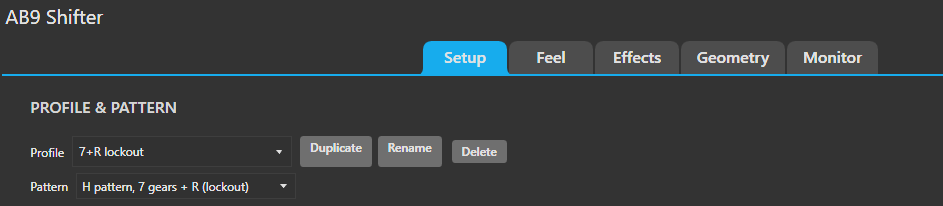
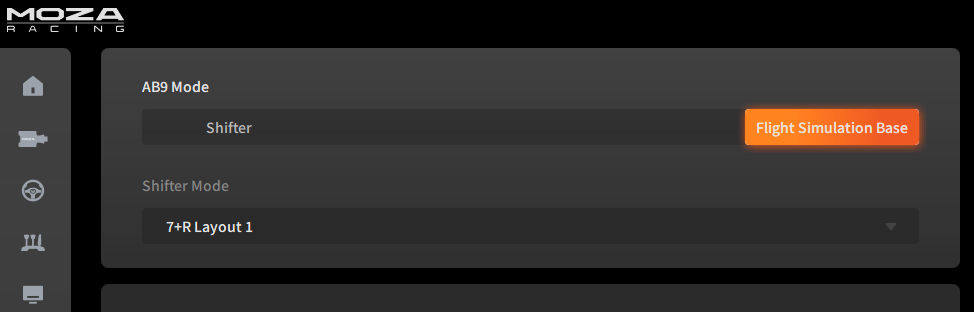
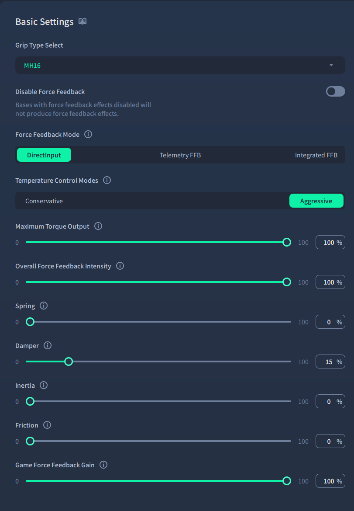
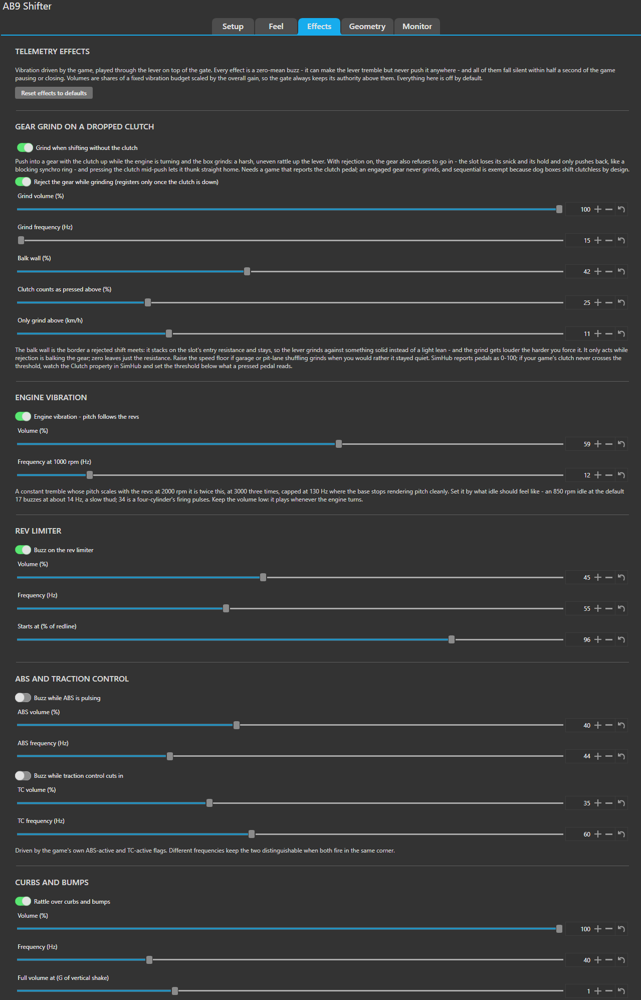
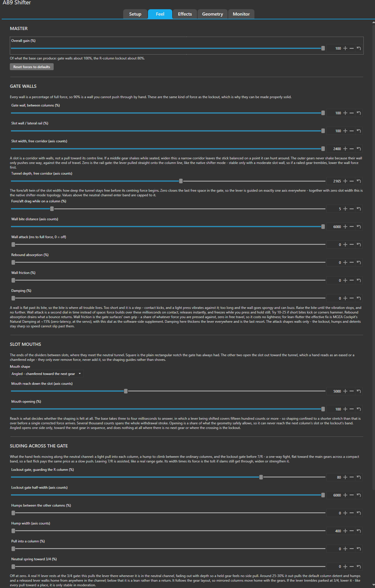

# AB9 Active Shifter

[](https://github.com/Gugic/ab9-shifter-simhub-plugin/actions/workflows/ci.yml)

An alternative to the MOZA AB9's own shifter mode. This SimHub plugin renders the shift gate
itself in force feedback — including the **configurable lockout** (push-through or hotkey-released, guarding 7th and reverse out of the box) that
the stock firmware has no setting for — and plays a **much wider range of telemetry effects**
through the lever: a clutch grind that can refuse the gear, engine vibration, a rev limiter,
ABS and traction control, curbs. The selected gear comes out as **vJoy buttons**, so any game
binds it like an ordinary shifter.



## Read this first

**It drives a 12 Nm active device, and the risk is yours.** The AB9 is a servo strong enough to
hurt a wrist and to slam its own stops. This plugin computes forces in software, several
milliseconds of USB away from that motor, and a force rendered through that delay can go unstable
and oscillate on its own — most of this project's design exists to keep that from happening, which
is also an admission that it can. A bug, an unlucky combination of settings, or a stalled loop can
make the base shake, kick, or drive to a stop with no warning. Treat it as the powerful machine it
is: keep your face and your free hand clear, start with the gain low, and know where the base's
power switch is before you enable anything. You run it at your own risk. Nobody is liable for
injury, or for damage to your hardware or anything attached to it, and there is no warranty of any
kind — see [LICENSE](LICENSE).

**Unofficial.** Not affiliated with, endorsed by, or supported by MOZA, SimHub or vJoy. "MOZA" and
"AB9" appear here only to say which hardware this works with. Do not take a problem caused by this
plugin to MOZA's support — a base running it is being driven by third-party software they did not
write.

**Early software.** It is in active development and is nowhere near polished. It has been built
and tuned against exactly one base on one firmware revision, so behaviour on yours is genuinely
untested; defaults, dial names and saved settings can still change between versions. Expect rough
edges, and read [docs/tuning.md](docs/tuning.md) when something feels wrong before assuming it is
meant to feel that way.

## Setup

### 1. What you need

- **SimHub** — developed against 9.11.21
- A **MOZA AB9** base on firmware **1.1.3.4 or newer** — developed and tested against **1.1.5.2**
- **MOZA Pit House** and **MOZA Cockpit**, for the one-time base configuration below
- [**vJoy**](https://sourceforge.net/projects/vjoystick/) with a device exposing at least
  **14 buttons** — 1–8 carry the H patterns, 9 and 10 the sequential up/down, 11–14 the automatic's
  P, R, N and D. Fewer still works for whatever fits. The Setup tab lists
  the devices vJoy reports with their button counts, so you can check this without guessing; the
  gate itself works without vJoy, you just get no gear output
- .NET Framework 4.8, already present if SimHub runs

### 2. Put the base in flight mode — MOZA Pit House

The AB9 has two firmware modes, and the switch lives in **Pit House**, under **AB9 Mode**. Set it
to **Flight Simulation Base**.



That is what makes the base enumerate as the two-axis DirectInput force feedback joystick this
plugin opens. In *Shifter* mode the base runs its own gate in firmware and does not present the
axes at all, so the plugin has nothing to read.

The **Shifter Mode** dropdown greyed out underneath is the stock feature this plugin replaces —
fixed layouts and no lockout. It is not effect-less: it plays engine-rpm vibration and a shift
effect of its own. What it has no notion of is the rest of a game's telemetry — the rev limiter,
ABS, traction control, curbs and the clutch grind below are all things this plugin adds. None of
it has any bearing on anything once the base is in flight mode.

### 3. Set up the force feedback — MOZA Cockpit

**Also not optional**, and it is a different app from the last step. The AB9 self-centres in
firmware, and DirectInput's request to switch that off is ignored — measured, across five
configurations. Cockpit's **Spring** is the only place it can be turned off; Pit House has no
Spring setting in flight mode at all. Skip this and the base fights the gate everywhere with its
own centring.



| Setting | Value |
| --- | --- |
| Force Feedback Mode | **DirectInput** |
| Spring | **0%** |
| Damper | **15%** |
| Maximum Torque Output | 100% |
| Overall Force Feedback Intensity | 100% |
| Game Force Feedback Gain | 100% |
| Inertia, Friction | 0% |

**Spring 0** is the one that matters most — it is the base's centring, and the gate cannot work
around it.

**Damper 15%** is optional but recommended. It is real damping applied in the base's own servo
loop, ahead of the USB round trip that everything this plugin renders has to cross, and it
settles the last bit of flutter a hand can provoke by leaning hard on a wall. It is the one kind
of damping that does not make the lever feel thick — the plugin's own damping dial is a last
resort by comparison.

Then **exit Cockpit completely**: it holds the stick exclusively while open, and the plugin
cannot acquire the device until it lets go. Close any Pit House live-tuning page for the same
reason.

### 4. Install the plugin

Download the zip from the [latest
release](https://github.com/Gugic/ab9-shifter-simhub-plugin/releases/latest), **close SimHub**, and
copy `AB9ActiveShifter.dll` out of it into `C:\Program Files (x86)\SimHub\`. SimHub locks the DLL
while it runs, so the copy fails if you skip that.

Start SimHub and enable **AB9 Active Shifter** under *Settings → Plugins*.

That is the whole install. You start with seven ready-made **presets** — **7+R lockout**, **7+R
lockout (short throw, loose)**, **5+R**, **5+R wide**, **Sequential**, **Automatic (PRND)** and
**Truck 6-gear (low-range lockout)** — each holding its own complete tuning, so you begin from
gates that were tuned on real hardware rather than from bare defaults. Forces are off and the force
cap is on, as they should be on a base nobody has measured yet.

Four of the H presets are the **same gate**, and the only thing you are choosing between them is
the pattern, how far the lever travels, and how wide the gate stands: *7+R lockout* runs the full
throw, where the lever carries on to the base's own stop, *short throw* gives the slots a bottom of
their own so the stroke ends about two thirds of the way in, and the two *5+R* entries are that
same gate on three columns — the plain one narrowed to 60% of the stick so a shift is about the
reach a 7+R asks for, the *wide* one spread over the whole of it. Everything about how the gate
feels — the wall, the lockout's toll, the width of the corridors, the weight of the detent — is
identical in all four.

The *truck* preset is deliberately not one of them. Its numbers came back from someone driving a
real Eaton-Fuller box, and where a racing gate is fast and slick, a truck gate is slow and hard and
deliberate: a throw of nearly the whole of travel, a slot the hand has to push *into* rather than
fall into, a lighter seat once it is there, and a gentler low-range gate on firmer columns —
because that gate is crossed on almost every downshift, where a 7/R gate is crossed twice a
session. If you want a racing feel on six truck slots, start from *7+R lockout* and switch the
pattern instead.

It is narrowed to 60% as well, for the same reason 5+R is: six slots spread over the whole stick is
a long reach, and a truck box is already asking for a long push fore and aft.

Presets are marked `(Preset)`, sit at the end of the profile list, and never change: they are
there to be a fixed starting point you can always come back to. Turn any dial while one is
selected and the edit quietly moves to a profile of your own with the same name — `7+R lockout`,
then `7+R lockout 2` for the next attempt — leaving the preset exactly as it was. Your own
profiles rename, delete and export like anything else.

Building it yourself instead, and the `install.ps1` script that does all of the above in one step:
[DEVELOPMENT.md](DEVELOPMENT.md).

### 5. Measure polarity

Some AB9 firmware revisions apply DirectInput effects backwards, which would turn a centring
force into one that throws the stick at its stops. Until this is measured the plugin **caps its
force output at 10%**, and **only the Setup tab is shown** — there is no point offering force
dials before it is known which way the base pushes. This step is what unlocks the shifter.

The other tabs appear once polarity is measured *and* a vJoy device is available. Everything
needed to satisfy both is on the Setup tab, including the vJoy picker and the base's vendor and
product ids, so the gate can never hide the control that opens it.

On the **Setup** tab press **Measure polarity**, take your hands off the stick, and wait about
ten seconds. The plugin pushes the stick briefly each way, on each axis, for each effect family,
and watches which way it actually moves.

It measures rather than asking because there is nothing useful for a hand to report: the base
holds itself centred, so a correct centring force and the base's own centring feel identical,
and an inverted one just feels like a weaker hold. Each probe is scored on whether the stick
moved the direction it was commanded, and summing the pair cancels any resting bias. A probe
stops the moment its direction is certain, so an inverted effect never reaches the stops.

Four probes run — a push and a spring on each axis — but only the two push results become
settings, because every wall in this gate is a push. The spring probes are a device check: all
four have to give a definite answer before the cap lifts, since a base that answers
unpredictably on either kind of effect is not one to trust at full force. This unit shows why
they are measured separately rather than assumed alike — its push is inverted left/right but
correct fore/aft, while its spring is the other way round.

If a probe reports the stick **barely moved**, the cap deliberately stays on: an unmeasured
direction is exactly the case it exists for. Check that nothing is touching the stick, then
raise *Calibration force* and run it again. It defaults to 10%, which is enough on this base — a
probe stops as soon as its direction is certain, so what it needs is a movement that can be read,
not a large one.

Once measured, the whole section collapses to its result and a **Measure again** button. Polarity
is a property of the base rather than of a profile, so it only wants remeasuring if the hardware
changes or the gate starts pushing the wrong way.

### 6. Switch the forces on

The shifter **starts off**. Enabling it takes the base exclusively and begins applying force, so
do it deliberately: put a hand on the stick, then tick *Shifter force feedback enabled* on the
Setup tab.

Raise the overall gain slowly from there. This is a 12 Nm base.

### 7. Bind the gears in your game

Bind gears **1–7 and reverse to vJoy buttons 1–8**, the sequential up/down to **9 and 10**, and the
automatic's **P, R, N and D to 11–14**. Do **not** bind the AB9's own axes in the game — the plugin
is what reads them.

Reverse is always button 8 wherever a pattern has one, and each later range sits above the last,
so one set of bindings covers every pattern and no binding can ever mean two things (the truck
pattern simply uses buttons 1–6 and nothing else).

## The gate

```
   1     3     5     7
   |     |     |     |
   +-----+--+--+--#--+     +  column        -- neutral channel
   |     |     |     |     #  lockout gate   -  ordinary hump
   2     4     6     R
```

Four columns: **1/2, 3/4, 5/6, 7/R**, reverse bottom-right. The stick is not read as a joystick —
the plugin renders walls between the columns, a tunnel to slide along, and a detent that snicks
into each slot.

Sliding along the neutral tunnel there is a light hump between the ordinary columns, and
immediately past 5/6 the **lockout gate**: a compact band of flat force pushing back toward the
main gears the whole way across. Crossing it costs the same effort however fast you move the
lever, so it cannot be flicked through. Coming back out of 7/R is assisted, like a real range
gate. Once slotted in 7 or R the column behaves exactly like the others. The toll is the gate's
force (90% in the shipped profiles) times its width, and both are adjustable.

That is what the lockout is *for*: without one there is nothing between 5th and reverse but empty
travel, and a rushed downshift can find it. The whole design follows from wanting a barrier that a
hurried hand cannot get through by accident and a deliberate one can.

The lockout is **configurable** per profile: put it between any two columns or on a single slot's
mouth (a reverse lockout, say), point it either way or both, or turn it off. Beyond the
push-through toll there are two **hard modes**: the gate runs at full force and locked gears do
not register at all until a bound key releases it — one stays released until pressed again, the
other re-arms itself once the crossing completes, like a collar seating behind the shift. The
automatic's selector lane can carry a lockout of its own between chosen positions (P–R for an
out-of-park gate, R–N for a reverse guard), force-only — the selector always reports where the
lever really is.

Two rules make it feel mechanical rather than like a set of forces. A gear can only be left
**through the neutral tunnel** — leaning sideways, or shoving through a wall, will not hand you a
different gear, it just pushes you back into the one you are in. And pushing into a gear slightly
off-column is guided onto the slot by its **tapered mouth** rather than dead-ending against the
divider, the way a real gate's chamfered entry feeds the lever in.

An optional **neutral spring** (off by default) pulls the lever toward the 3/4 column while in
neutral, fading out with depth — dial it up and a released lever drifts home across the notches,
the way a real H lever rests at the 3/4 gate.

## Patterns

Six, selectable per **profile** on the Setup tab:

| Pattern | |
| --- | --- |
| **7+R** | The full gate above, with the lockout |
| **6+R** | The slot where 7 would sit genuinely does not exist — the wall over it never opens, so the lever cannot enter it at all. The stock firmware's 6+R leaves the seven-gear gate rendered with that slot merely inert, which is no guard against the misshift that choosing six gears is meant to prevent |
| **5+R** | Three wider columns, no lockout by default. Shipped twice - narrowed to 60% of the stick so a shift is about the reach a 7+R asks for, and *wide* at the full sweep |
| **Sequential** | A sprung fore/aft lever: one shift per stroke, with a click you can tune |
| **Automatic (P R N D)** | A selector lane: four fixed positions in a line, a button held at whichever one the lever is in. No neutral to come back through and no gear to engage — the lever is always somewhere |
| **Truck 6** | Three wider columns, six plain slots on buttons 1–6, no reverse anywhere — what each button means is your game's business. Made for Eaton-Fuller-style boxes: add the lockout between the first two columns (the shipped truck preset does exactly that) and you have a low-range gate |

**How wide the pattern stands is a dial too.** By default the columns are spread over the whole
stick, which is right for 7+R and a lot of reach for the three-column patterns — 5+R and the truck
6 put half as many columns across the same travel, so each shift crosses half again the distance.
*Pattern width* on the Geometry tab squeezes the pattern in from both sides, keeping its middle
where it is, with the live gate above the slider showing it happen. Around 67% gives a
three-column pattern the same reach a 7+R has.

Narrowing leaves bare travel outside the outermost columns, with no gear in it and — because the
neutral tunnel is deliberately free — nothing to stop the lever sliding into it. *Wall at the
pattern edge*, under the same slider, is that edge: one-way, inward only, zero everywhere inside
the pattern, and it renders nothing at all at full width.

A profile stores every dial together with its pattern, so each pattern keeps its own tuning and
switching between them is one dropdown. *Next profile* and *Previous profile* are bindable actions
if you would rather not use the dropdown.

**A profile can also claim cars.** Under *Vehicle models (optional)* on the Setup tab, list the ids
your game reports for the cars that should bring that profile up — a five-speed car gets the 5+R
profile without your touching anything. **Add last used vehicle** fills in whatever the running game
last reported, which saves guessing at the exact string. Empty means the profile never
auto-activates, which is how every shipped profile starts.

**Profiles can be exported and imported**, so a tune can be shared as a file. What travels is the
tuning only: your measured polarity, your device and vJoy numbers, your loop rate and your car
mappings stay as they are on your machine. An import always *adds* a profile, numbering the name if
it is taken, so someone else's file can never land on top of yours — and it always arrives with
forces off, with every value range-checked on the way in.

## Game effects

With a game running, the **Effects** tab plays telemetry through the lever: **gear grind on a
clutchless shift** — push into a gear with the clutch up and the box rattles against a firm balk
wall, louder the harder you force it, and optionally the gear refuses to register until the
clutch goes down, like a blocking synchro ring — plus engine vibration that tracks the revs, a
rev-limiter buzz, ABS and traction-control buzzes, a curb-and-bump rattle read out of the car's
vertical acceleration, a gear-shift confirmation pulse, and a custom effect driven by any SimHub
property (which puts ShakeIt's exported effect groups on the lever).

Everything here is off by default, falls silent within half a second of the game pausing or
closing, and rides on top of the gate without touching its geometry. The grind needs a game that
reports the clutch pedal.



## Tuning

- **Feel** — master gain; the gate and slot walls with their bite distance, attack, rebound
  absorption and friction; the lockout gate and the humps; the slot mouths; the three
  slot-detent forces (resistance, pull, seated hold). Each section **draws the force curve its
  dials produce**, sampled from the force code itself and with your stick position tracked live
  on it, so a change can be seen before it is felt. Dials bounded by the geometry rather than by
  their slider print what the gate will actually use, and every slider has its own undo.
- **Effects** — the telemetry effects above, each with volume and frequency.
- **Geometry** — the positions the gate is built from: how wide the neutral tunnel and the
  columns are, how far a push must travel to engage a gear, the loop rate, and
  scoped resets.
- **Monitor** — a live drawing of the gate with the stick position and the shaded lockout band,
  plus a trace recorder that logs every tick to CSV so a feel problem can be replayed.



Changes apply on the next FFB tick; nothing needs restarting.

**[docs/tuning.md](docs/tuning.md) is the guide** — every dial, and a symptom-to-dial table for
when something feels wrong.

The first dial to know is **wall bite distance**. Past its bite a wall is a flat force and is
stable; all oscillation lives on the bite itself. Too short and contact kicks like ABS, too long
and the wall goes spongy. If neither end works, use **wall attack** instead.

## SimHub properties

Available for dashboards and formulas:

| Property | Meaning |
| --- | --- |
| `CurrentGear` | `N`, `1`…`7`, `R` |
| `GearIndex` | 0 for neutral, 1–8 (8 = reverse) |
| `InGear` | true while a gear is held |
| `GateState` | `Neutral`, `Traveling`, `Engaged` |
| `GateColumn` | `C1`…`C4`, or `None` |
| `StickX`, `StickY` | axis positions, 0–65535 |
| `DeviceConnected`, `VJoyConnected`, `DeviceName` | connection state |
| `LoopHz` | measured FFB loop rate |
| `StatusMessage` | the same text shown on the Setup tab |

Events: `GearEngaged`, `GearReleased`, `LockoutEngaged`, `LockoutReleased`. A `LockoutEngaged`
property says whether a hard-mode lockout is currently armed (always true when no hard mode is
configured).

### Actions you can bind to a button

| Action | What it does |
| --- | --- |
| `NextProfile` | Move one step around the profile cycle. **This is the one to bind** if you want a single button that swaps between, say, an H gate and a sequential lever. |
| `PreviousProfile` | The same, backwards. Only worth binding once three or more profiles are in the cycle. |
| `ToggleShifterFFB` | Turn the shifter's force feedback on and off. |
| `ReleaseAllGears` | Drop every held gear button and stop output — the panic button. |
| `ToggleLockout` | Release or re-engage a hard-mode lockout — the one-button key. Does nothing in push-through mode. |
| `EngageLockout` / `ReleaseLockout` | The same as an explicit pair, for a two-position switch that a toggle would fall out of step with. |

**Bind them on the Setup tab**, next to the thing they control: the profile keys under *Profile
hotkeys*, the force toggle and the panic release under *Enable*. Click the row, press the wheel
button or key, done. SimHub's own **Controls and events** page shows the same bindings if you
prefer to manage them all in one place — they are the same actions either way, listed there as
`AB9ShifterPlugin.NextProfile` and so on.

Which profiles `NextProfile` walks through is set on the plugin's **Setup** tab under *Profile
hotkeys* — tick the ones you want in the ring, or tick none and it walks through all of them.
Switching releases any held gear and clears a sequential pulse in flight before the new gate is
applied, so it is safe to press while driving.

## Safety

These are the bounds on output, not a guarantee — *Read this first* above is the part that
actually matters. The base can produce 12 Nm, so output is bounded on every path:

- Force is capped at 10% until polarity has been measured.
- A watchdog stops all output if the FFB loop stalls for more than a second.
- Shutdown, device loss, and disabling always release **buttons first, then forces, then the
  device** — so a gear can never stay stuck down.
- If SimHub exits or crashes, dropping the exclusive DirectInput handle makes the driver discard
  the effects.

## Troubleshooting

**"No device with VID 346E / PID 1000 found"** — the base is off, in a different mode, or another
program has it. The message lists what was detected.

**"The stick is held exclusively by another program"** — MOZA Cockpit or a Pit House tuning page,
occasionally a game. Close them; the plugin retries automatically.

**"vJoy device 1 is owned by another program"** — the message names the owning process. Close it,
or pick a different device from the **vJoy output** list on the Setup tab, which shows every device
vJoy reports along with its button count and whether anything already holds it.

**The stick fights you everywhere, or drifts to the stops** — polarity has not been measured, so
the gate's forces are pushing the opposite way. Run *Measure polarity*. To check whether the
resistance is coming from the plugin at all, tick *Release all forces (free stick)* on the Setup
tab: anything you still feel with that on is the hardware, so re-check Spring 0 in Cockpit.

**A wall buzzes, or kicks back like ABS** — see [docs/tuning.md](docs/tuning.md). Short answer:
adjust *wall bite distance* first, then *wall attack*.

**Everything feels dead, especially the lockout and the detents** — those are constant forces.
Confirm *Measure polarity* reported a result for both push axes rather than "barely moved", and
that overall gain is not near zero.

**Gears do not register in the game** — check `joy.cpl`: the vJoy device should light button *i*
while gear *i* is held. If it does, the binding is the problem, not the plugin.

## Documentation

| | |
| --- | --- |
| [docs/tuning.md](docs/tuning.md) | Every dial, and symptom → dial when something feels wrong |
| [DEVELOPMENT.md](DEVELOPMENT.md) | Building, testing, deploying, and how the code fits together |
| [docs/hardware.md](docs/hardware.md) | Measured facts about the base, the USB path, and MOZA's software |
| [docs/force-model.md](docs/force-model.md) | How the gate is built, and every approach that was tried and rejected |
| [docs/architecture.md](docs/architecture.md) | Threading, lifecycle, effect handling, safety |
| [AGENTS.md](AGENTS.md) | Contributor and agent orientation, with the invariants |

## Licence

MIT — see [LICENSE](LICENSE), whose second paragraph is the warranty and liability disclaimer
behind *Read this first*. Attribution, trademark notices and the clean-room note for BonusFFB are
in [NOTICE.md](NOTICE.md).
