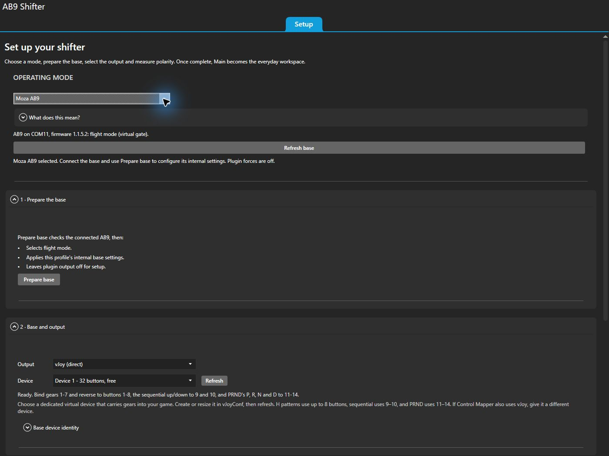
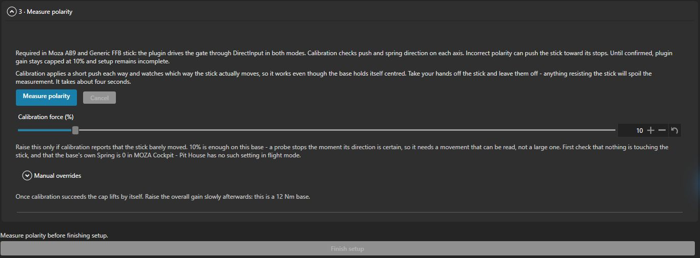
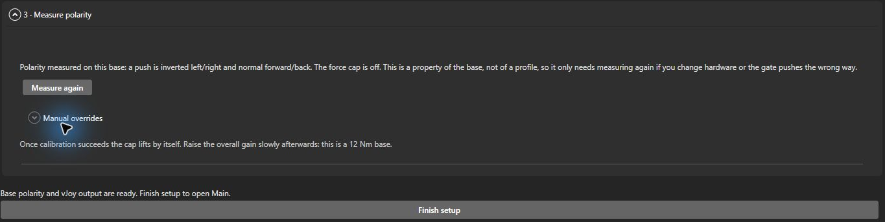
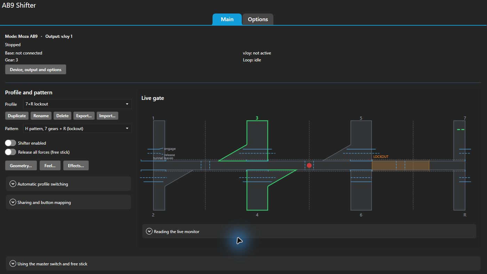
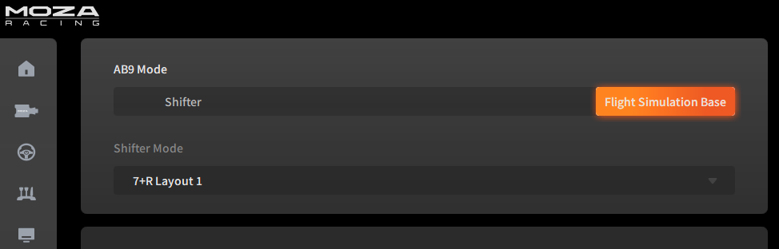

# Setup guide

[Documentation](README.md) · [Safety and notices](safety.md) · [Troubleshooting](troubleshooting.md)

This guide follows current `main`. Control Mapper output and the updated mode labels are
newer than v0.14.0; that release uses direct vJoy output.

On a supported AB9, initial setup happens inside the plugin. Install it, open **AB9 Shifter**
in SimHub's sidebar, and work through **Setup** once. After **Finish setup**, the plugin opens
**Main**; the same rig controls remain in **Options**. Restarting SimHub or disconnecting the
base does not send you through setup again.

## 1. Install

You need **SimHub**, .NET Framework 4.8, and a DirectInput force-feedback flight stick. The
**MOZA AB9** is the tested base; its onboard controls require firmware **1.1.5.2 or newer**.
Other DirectInput FFB sticks use the generic mode and require their own polarity measurement.
For gear output, choose either SimHub's **Control Mapper** or **vJoy** in step 3.

1. Download the zip from the [latest release](https://github.com/Gugic/ab9-shifter-simhub-plugin/releases/latest).
2. **Close SimHub**, then copy `AB9ActiveShifter.dll` from the zip into
   `C:\Program Files (x86)\SimHub\`. SimHub locks the DLL while running.
3. Start SimHub and enable **AB9 Active Shifter** under **Settings → Plugins**. Open
   **AB9 Shifter** in the sidebar.

A fresh install starts with forces off, the 10% polarity cap in place, and the **Setup** page.
Building from source instead: [DEVELOPMENT.md](../DEVELOPMENT.md).

## 2. Choose the mode and prepare the base

The **OPERATING MODE** choice describes who drives the base. It is separate from the gear
**Output** choice in the next step.

| Mode | What it does | Preparation |
| --- | --- | --- |
| **Moza AB9** | Plugin gate, profiles and telemetry effects, with the basic spring, damper, friction and inertia processed onboard | Connect an AB9 on firmware **1.1.5.2+**, then use **Prepare base** |
| **Generic FFB stick** | The same plugin gate and profiles, with base effects sent through DirectInput | Configure the stick in its own software and follow **BEFORE YOU START** |
| **Moza AB9 native H-Pattern** | MOZA's firmware shifter and physical AB9 buttons; plugin profiles, tuning and output are disabled | Configure the firmware shifter in **Moza Pit House / AZOM**; no plugin polarity calibration is needed |

**For Moza AB9:** close Cockpit, Pit House and AZOM's AB9 connection so the configuration port
is free. Select **Moza AB9**, then click **Prepare base** under **1 · Prepare the base**. This
selects flight mode and DirectInput feedback, applies the profile's onboard settings, verifies
them, and leaves plugin output off. You do not need to enter the Cockpit values by hand.
If the base was just connected or its port was busy, use **Refresh base** and try again.

**For Generic FFB stick:** follow the numbered **BEFORE YOU START** checklist. Select
DirectInput feedback and turn off built-in centring and other background effects in the
stick's own configuration app, then close applications holding it exclusively. Under
**2 · Base and output → Base device identity**, enter its USB **Vendor id** and **Product id**
in hexadecimal. The default `346E / 1000` identifies the AB9. For an AB9 using this mode,
see the [manual preparation steps](#manual-ab9-preparation-for-generic-mode).

Selecting a mode saves a preference and turns plugin output off; it does not change the
base's firmware mode by itself. All modes can be selected while disconnected, but onboard
configuration requires a verified, connected AB9 with supported firmware. **Base is not found**
means you need to connect and power on the selected device before continuing.

Both virtual modes use **one set of profiles and the same percentages**. Only the provider of
Cockpit-compatible base effects changes; the gate, detents, lockouts, software stability and
telemetry effects continue through DirectInput in both modes. Equal percentages do not imply
equal physical strength. [Native configuration details](native-ab9.md).

## 3. Choose how gears reach the game

Open **2 · Base and output** and select **Output**. After setup, these controls live in
**Options → Base and output**.

| Output | Setup |
| --- | --- |
| **vJoy (direct)** | Install [vJoy](https://sourceforge.net/projects/vjoystick/), create a virtual device with **14 buttons** in Configure vJoy, then select it under **Device**. Use **Refresh** after changing its configuration. The picker shows button counts and ownership. |
| **SimHub Control Mapper (native)** | Enable SimHub's Control Mapper feature, configure its keyboard or controller output, and assign existing roles to the plugin's gear mappings. Follow the steps below. |

Fourteen vJoy buttons cover every pattern. An eight-button device covers H patterns but cannot
send sequential buttons 9–10 or PRND buttons 11–14. If Control Mapper also uses vJoy, give it a
different virtual device so the two outputs do not compete for ownership.

For **SimHub Control Mapper (native)**:

1. Read the feature status. If needed, click **Enable Control Mapper and restart SimHub** or
   **Restart SimHub to load Control Mapper**. **Controls and events** is a different feature.
   If automatic enabling is unavailable, enable Control Mapper in SimHub's **Add/remove features**
   and restart.
2. Click **Configure Control Mapper**, then **Assign roles**. Configure roles under **Keyboard**
   for simulated keys, or use its vJoy/Arduino bridge output for controller buttons.
3. Return to the plugin, click **Refresh roles**, and assign roles under **H-pattern mappings**,
   **Sequential mappings** and **PRND mappings**. All three groups are shown together. Typing
   a name here does not create a role; blank mappings send nothing.
4. Leave **H-pattern neutral (optional)** blank unless the game needs an explicit neutral key.
   PRND's N is different: it has its own held role, just like P, R and D.

The output choice and assignments belong to the rig, so switching or importing profiles keeps
them. See [gear-output details](tuning.md#setup-and-gear-output) for role examples and
connection behavior.

## 4. Measure polarity and finish setup

Both **Moza AB9** and **Generic FFB stick** require this: the plugin drives their gate through
DirectInput, and effect direction can differ by axis and effect family.

1. Under **3 · Measure polarity**, take your hands off the stick and click **Measure polarity**.
   Leave the lever free while the short probes run. The action opens the base for calibration;
   you do not need to enable the shifter first.
2. Wait for a conclusive result for all four combinations: push and spring on each axis.
   The plugin saves the measured signs and lifts its **10% force cap** automatically. In
   **Moza AB9** mode it temporarily clears onboard resistance for the probes, then restores
   the profile's base effects after successful calibration. Plugin output stays off.
3. Click **Finish setup** to open **Main**. This becomes available when the base is present,
   polarity is confirmed, and the chosen output is ready. For Control Mapper, that means
   its feature is loaded and at least one assigned role exists for the current pattern;
   still check every required binding in the game.

If a probe says the stick **barely moved**, leave the cap in place. Check that nothing is
resisting the lever and, in generic mode, that built-in centring is off. Only then raise
**Calibration force (%)** from its 10% default and try again. Do not tick the manual
**Polarity confirmed - remove the 10% force cap** override to bypass an inconclusive result.

Calibration belongs to the rig, not a profile. You do not repeat it for each preset. To
revisit these controls later, open **Options → Polarity calibration**; **Measure again**
reveals the controls, then **Measure polarity** starts a new measurement.
**Options → MAINTENANCE → Review setup** reopens the checklist
without deleting the saved calibration.

## 5. Choose a profile and enable the shifter

**Main** brings the connection status, **Profile**, **Pattern**, master switch and **Live gate**
together. Pick a preset for the pattern you want, open **Feel…**, and check **Overall gain (%)**
before enabling force. Start low and raise it gradually with a hand on the lever.

The screenshots show example settings, not recommended starting strengths.

There are nine presets: **7+R lockout**, **7+R lockout (short throw, loose)**,
**7+R lockout (short throw, stiff, sport)**, **5+R**, **5+R wide**,
**Sequential**, **Sequential (stiff, short)**, **Automatic (PRND)** and
**Truck 6-gear (low-range lockout)**. They are marked `(Preset)` in the picker. Changing a
profile dial automatically creates an editable copy and keeps the preset available; use
**Duplicate** to make a copy deliberately. [Preset details](tuning.md#presets-and-why-your-profile-just-renamed-itself).

Turn on **Shifter enabled** when ready. This is the master switch for both the base and gear
output. **Release all forces (free stick)** releases the plugin's DirectInput forces while
keeping the connections; onboard AB9 resistance can remain. Turning the master off clears
buttons and releases both devices.

While the master is off, **Stopped**, **Base: not connected** and **vJoy: not active** describe
the engine's released connections. They do not mean that the calibration was lost; Options
shows the separate base-detection status.

Settings apply as you edit them. Software settings apply on the next FFB tick; onboard effects
and hardware gains apply after about **500 ms** without another edit. A successful ordinary
update preserves the master switch while briefly pausing output for verification. Mode changes,
setup, calibration and failed writes leave output off. There is no Apply button.

## 6. Bind and check the game output

For **vJoy (direct)**, bind the virtual controller's buttons:

| Pattern | Buttons |
| --- | --- |
| H pattern | **1–7** for forward gears; **8** for reverse in every pattern that has it |
| Truck six-slot gate | **1–6**; no reverse |
| Sequential | **9** for up, **10** for down |
| Automatic PRND | **11**, **12**, **13**, **14** for P, R, N, D |

Check the vJoy device in Windows Game Controllers (`joy.cpl`): a held H gear or PRND position
holds its button; sequential produces a pulse. H-pattern neutral releases the gear buttons.

For **SimHub Control Mapper (native)**, bind the configured keys or controller buttons in the
game. Check direct gear selection and return to neutral, plus every sequential or PRND mapping
you use. The plugin knowing a role exists does not prove its external output is configured.

In the two virtual modes, do **not** bind the AB9's own axes as game controls. If a game takes
the base exclusively, use [HidHide](https://github.com/nefarius/HidHide): allow `SimHubWPF.exe`
first, then hide the AB9's *HID-compliant game controller* interface (`MI_02`) from the game.
Leave its `MI_00` configuration port visible. The game only needs your chosen gear output.
For **Moza AB9 native H-Pattern**, make the physical AB9 visible instead and bind its own buttons.

**After setup:** use the [usage guide](usage.md#where-settings-live-after-setup) to find the profile controls and tuning editors.

## Manual AB9 preparation for generic mode

Use this for Generic FFB stick, including AB9 firmware older than 1.1.5.2

Supported AB9s using **Moza AB9 → Prepare base** can skip this procedure.

In **MOZA Pit House**, set **AB9 Mode** to **Flight Simulation Base**. Firmware shifter mode
runs its own gate and does not provide the flight axes the plugin needs.

In **MOZA Cockpit**, select DirectInput feedback and configure these basic settings:

| Setting | Value for generic mode |
| --- | --- |
| Force Feedback Mode | **DirectInput** |
| Spring, Damper, Inertia, Friction | **0%** |
| Maximum Torque Output | **100%** |
| Overall Force Feedback Intensity | **100%** |
| Game Force Feedback Gain | **100%** |

**Spring 0% matters:** the AB9 ignores DirectInput's request to disable its built-in centring.
Leaving it on makes the hardware fight the plugin's gate. Turn the other background effects
off too so generic mode owns them. Then **exit Cockpit completely** and close Pit House's
tuning page before returning to the plugin. Continue with output and polarity measurement above.

## Updating the plugin

The plugin checks this repository's latest stable GitHub release on startup and every six
hours. Under **Options → UPDATES**, **Check now** checks immediately; **Check for updates
automatically** turns scheduled checks on or off. During first-run setup, the same **UPDATES**
section is farther down the **Setup** page and works before calibration is complete.

When a newer release is available, a banner above the tabs offers **Install update**, **Open
release notes**, and **Dismiss**. Install downloads and verifies the DLL, then offers **Restart
SimHub** to load it when you are ready. Profiles and calibration stay saved. Dismiss hides that
version's banner; the Options tab still shows it, and a newer release appears again.

The updater requires the release's standalone `AB9ActiveShifter.dll` asset and its GitHub
SHA-256 checksum. If the release has no installable asset, use Open release notes to install
manually. If SimHub cannot write to its install folder, run it as administrator or copy the
release DLL there with SimHub closed. Offline checks leave the plugin running and can be retried.
