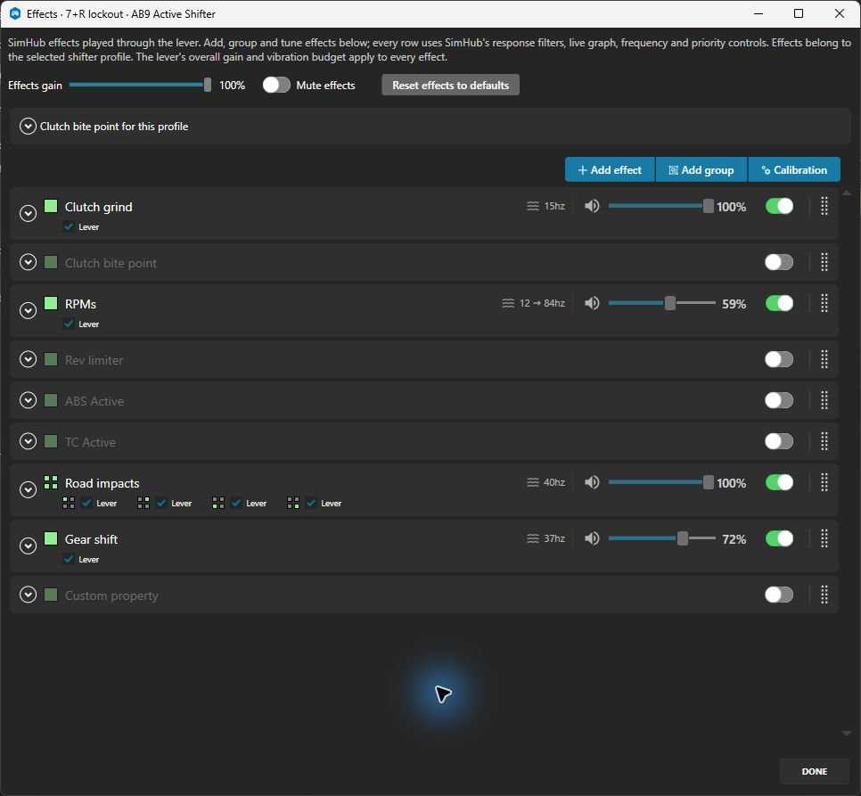

# Using the shifter

[Documentation](README.md) · [First-time setup](setup.md) · [Tuning reference](tuning.md)

Start here after **Finish setup**. Main holds the active profile and live monitor; Options
holds the rig settings. This guide explains the patterns, profile behavior and available feedback.

## Where settings live after setup

| Screen | What belongs there |
| --- | --- |
| **Main** | Status, profile management, pattern, live gate, master/free-stick switches, automatic profile switching and sharing |
| **Geometry…** | Pattern size, travel, corridors, mouths, detection, lockout position/direction/width; the live monitor stays above the scrolling controls |
| **Feel…** | Overall gain, base effects, wall/detent/lockout strengths and software stability; **Base-driven effects** identifies onboard processing in Moza AB9 mode |
| **Effects…** | SimHub's native effect editor, effect gain/mute, clutch behavior and feedback routed to **Lever** |
| **Options** | Operating mode, base/output, calibration, pedals, hotkeys, diagnostics and traces, maintenance, updates and About |

**Geometry…**, **Feel…** and **Effects…** open separate editors from Main. **Done** closes the
editor; changes have already applied. The available controls follow the selected pattern.
Opening Feel reads native AB9 settings once; it does not keep polling them while you drive.
Use **Options → Refresh base** for another read.

## The gate

```
   1     3     5     7
   |     |     |     |
   +-----+--+--+--#--+     +  column        -- neutral channel
   |     |     |     |     #  lockout gate   -  ordinary hump
   2     4     6     R
```

Four columns: **1/2, 3/4, 5/6, 7/R**, reverse bottom-right. The stick is not read as a joystick —
the plugin renders walls between the columns, a tunnel to slide along, and a detent that snicks
into each slot.

Sliding along the neutral tunnel there is a light hump between the ordinary columns, and
immediately past 5/6 the **lockout gate**: a compact band of flat force pushing back toward the
main gears the whole way across. Crossing it costs the same effort however fast you move the
lever, so it cannot be flicked through. Coming back out of 7/R is assisted, like a real range
gate. Once slotted in 7 or R the column behaves exactly like the others. The toll is the gate's
force (90% in the shipped profiles) times its width, and both are adjustable.

That is what the lockout is *for*: without one there is nothing between 5th and reverse but empty
travel, and a rushed downshift can find it. The whole design follows from wanting a barrier that a
hurried hand cannot get through by accident and a deliberate one can.

The lockout is **configurable** per profile: put it between any two columns or on a single slot's
mouth (a reverse lockout, say), point it either way or both, or turn it off. Beyond the
push-through toll there are two **hard modes**: the gate runs at full force and locked gears do
not register at all until a bound key releases it — one stays released until pressed again, the
other re-arms itself once the crossing completes, like a collar seating behind the shift. The
automatic's selector lane can carry a lockout of its own between chosen positions (P–R for an
out-of-park gate, R–N for a reverse guard), force-only — the selector always reports where the
lever really is.

Two rules make it feel mechanical rather than like a set of forces. A gear can only be left
**through the neutral tunnel** — leaning sideways, or shoving through a wall, will not hand you a
different gear, it just pushes you back into the one you are in. And pushing into a gear slightly
off-column is guided onto the slot by its **tapered mouth** rather than dead-ending against the
divider, the way a real gate's chamfered entry feeds the lever in.

An optional **neutral spring** (off by default) pulls the lever toward the 3/4 column while in
neutral, fading out with depth — dial it up and a released lever drifts home across the notches,
the way a real H lever rests at the 3/4 gate.

## Patterns

Six, selectable per **profile** on Main:

| Pattern | |
| --- | --- |
| **7+R** | The full gate above, with the lockout |
| **6+R** | The slot where 7 would sit genuinely does not exist — the wall over it never opens, so the lever cannot enter it at all. The stock firmware's 6+R leaves the seven-gear gate rendered with that slot merely inert, which is no guard against the misshift that choosing six gears is meant to prevent |
| **5+R** | Three wider columns, no lockout by default. Shipped twice - narrowed to 60% of the stick so a shift is about the reach a 7+R asks for, and *wide* at the full sweep |
| **Sequential** | A sprung fore/aft lever: one shift per stroke, with a click you can tune |
| **Automatic (P R N D)** | A selector lane: four fixed positions in a line, a button held at whichever one the lever is in. No neutral to come back through and no gear to engage — the lever is always somewhere |
| **Truck 6** | Three wider columns, six plain slots on buttons 1–6, no reverse anywhere — what each button means is your game's business. Made for Eaton-Fuller-style boxes: add the lockout between the first two columns (the shipped truck preset does exactly that) and you have a low-range gate |

**How wide the pattern stands is a dial too.** By default the columns are spread over the whole
stick, which is right for 7+R and a lot of reach for the three-column patterns — 5+R and the truck
6 put half as many columns across the same travel, so each shift crosses half again the distance.
*Pattern width* in Geometry squeezes the pattern in from both sides, keeping its middle
where it is, with the live gate above the slider showing it happen. Around 67% gives a
three-column pattern the same reach a 7+R has.

Narrowing leaves bare travel outside the outermost columns, with no gear in it and — because the
neutral tunnel is deliberately free — nothing to stop the lever sliding into it. *Wall at the
pattern edge*, under the same slider, is that edge: one-way, inward only, zero everywhere inside
the pattern, and it renders nothing at all at full width.

A profile stores every dial together with its pattern, so each pattern keeps its own tuning and
switching between them is one dropdown. *Next profile* and *Previous profile* are bindable actions
if you would rather not use the dropdown.

**A profile can also claim cars.** Open **Automatic profile switching** on Main and enter one
vehicle ID per line. **Add last vehicle** uses the ID the game last reported. A matching vehicle
activates that profile when the car changes; leave the list empty for manual selection.
**Sharing and button mapping** is a separate, compact help section.

**Profiles can be exported and imported**, so a tune can be shared as a file. What travels is the
tuning only: your measured polarity, your device and vJoy numbers, your loop rate and your car
mappings stay as they are on your machine. An import always *adds* a profile, numbering the name if
it is taken, so someone else's file can never land on top of yours — and it always arrives with
virtual forces off, with every value range-checked on the way in. In Moza AB9 mode, the
imported profile's onboard base settings apply automatically while virtual output stays off.

## Game effects

With a game running, **Main → Effects…** plays telemetry through the lever: **gear grind on a
clutchless shift** — push into a gear with the clutch up and the box rattles against a firm balk
wall, louder the harder you force it, and optionally the gear refuses to register until the
clutch goes down, like a blocking synchro ring — plus engine vibration that tracks the revs, a
rev-limiter buzz, ABS and traction-control buzzes, a curb-and-bump rattle read out of the car's
vertical acceleration, a gear-shift confirmation pulse, and a custom effect driven by any SimHub
property (which puts ShakeIt's exported effect groups on the lever).

Effects ride on top of the gate without changing its geometry. Ordinary effects fall silent
within half a second of stale or inactive telemetry; a running **Test** can play without a game.
Check the selected profile's enabled rows before driving: presets can include enabled effects.
The grind uses either the game's clutch reading or a pedal bound under **Options → Pedals**.



## Tuning

- **Feel** — master gain, base effects, wall and detent strengths, lockout resistance, attack,
  rebound absorption and software stability. Force curves come from the actual force model,
  with the live stick position shown; each slider supports undo.
- **Effects** — SimHub's telemetry-effect editor, including gain, frequency, filters and groups.
- **Geometry** — pattern size, travel, corridor and mouth shapes, lockout placement and widths,
  and gear detection. The live monitor stays above its controls while you scroll.
- **Main** — the live gate beside the profile, pattern and force controls. **Options → Diagnostics**
  holds the trace recorder and loop rate.

Software changes apply on the next FFB tick. Moza AB9's seven onboard dials apply after
500 ms without another edit, pausing output until the latest settings are verified. An enabled
session resumes after a successful update; turning it off or pressing panic always takes
precedence. No Apply button or restart is needed.

**[docs/tuning.md](tuning.md) is the guide** — every dial, and a symptom-to-dial table for
when something feels wrong.

The first dial to know is **wall bite distance**. Past its bite a wall is a flat force and is
stable; all oscillation lives on the bite itself. Too short and contact kicks like ABS, too long
and the wall goes spongy. If neither end works, use **wall attack** instead.

## SimHub properties

Available for dashboards and formulas:

| Property | Meaning |
| --- | --- |
| `CurrentGear` | `N`, `1`…`7`, `R` |
| `GearIndex` | 0 for neutral, 1–8 (8 = reverse) |
| `InGear` | true while a gear is held |
| `GateState` | `Neutral`, `Traveling`, `Engaged` |
| `GateColumn` | `C1`…`C4`, or `None` |
| `StickX`, `StickY` | axis positions, 0–65535 |
| `DeviceConnected`, `VJoyConnected`, `DeviceName` | connection state |
| `LoopHz` | measured FFB loop rate |
| `StatusMessage` | the same working status shown on Main |

Events: `GearEngaged`, `GearReleased`, `LockoutEngaged`, `LockoutReleased`. A `LockoutEngaged`
property says whether a hard-mode lockout is currently armed (always true when no hard mode is
configured).

### Actions you can bind to a button

| Action | What it does |
| --- | --- |
| `NextProfile` | Move one step around the profile cycle. **This is the one to bind** if you want a single button that swaps between, say, an H gate and a sequential lever. |
| `PreviousProfile` | The same, backwards. Only worth binding once three or more profiles are in the cycle. |
| `ToggleShifterFFB` | Turn the shifter's force feedback on and off. |
| `ReleaseAllGears` | Drop every held gear button and stop output — the panic button. |
| `ToggleLockout` | Release or re-engage a hard-mode lockout — the one-button key. Does nothing in push-through mode. |
| `EngageLockout` / `ReleaseLockout` | The same as an explicit pair, for a two-position switch that a toggle would fall out of step with. |

**Bind them in Options → Hotkeys**, under **PROFILE HOTKEYS** or **FORCES AND LOCKOUT HOTKEYS**.
Click the row, press the wheel
button or key, done. SimHub's own **Controls and events** page shows the same bindings if you
prefer to manage them all in one place — they are the same actions either way, listed there as
`AB9ShifterPlugin.NextProfile` and so on.

Which profiles `NextProfile` walks through is set under **Options → Hotkeys → PROFILE HOTKEYS** —
tick the ones you want in the ring, or tick none and it walks through all of them.
Switching releases any held gear and clears a sequential pulse in flight before the new gate is
applied, so it is safe to press while driving.
